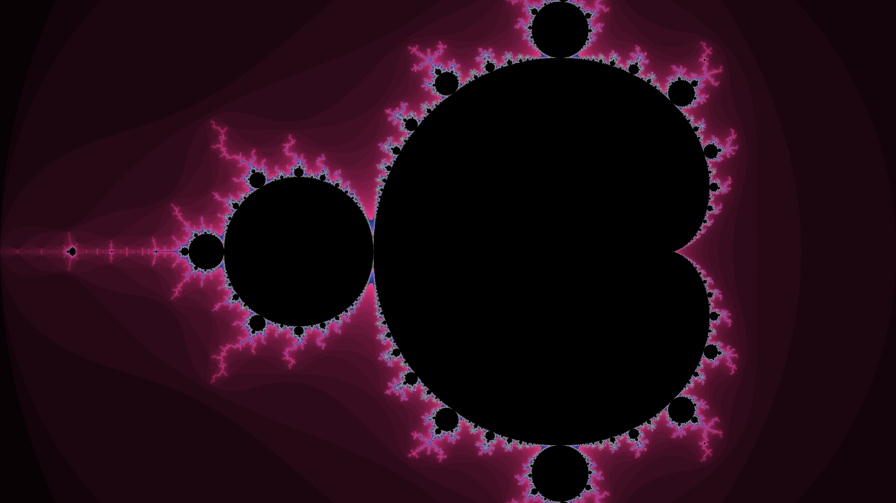
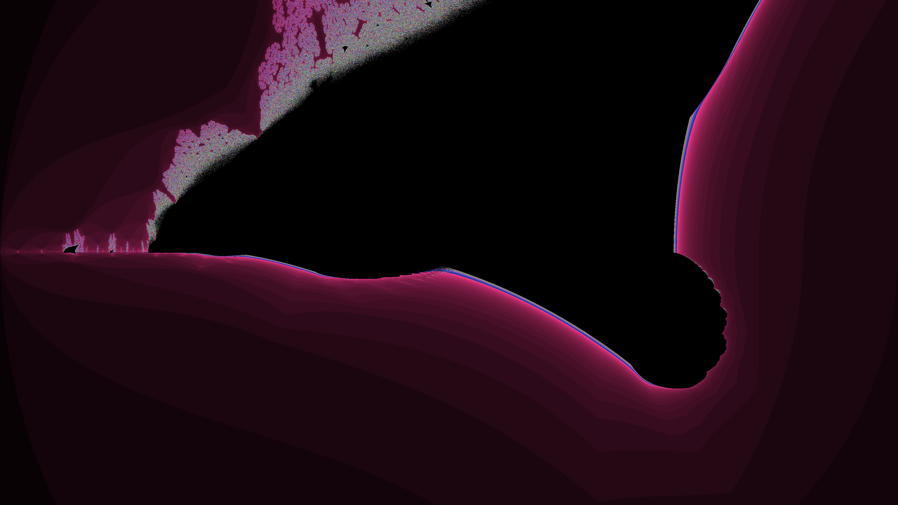

# FractalCPP - Parallel Fractal Generator

A high-performance C++ application that generates high-resolution fractals using multi-threading. This project demonstrates custom thread pool implementation, complex number arithmetic, and PPM image rendering.

## Generated Examples

### Mandelbrot Set


### Julia Set


### BurningShip Set


*Note: The raw output is in PPM format. The images above were converted to PNG for display.*

## Features
- **Multi-threaded Processing**: Uses a custom `ThreadPool` to parallelize rendering across rows.
- **Multiple Fractals**: Supports **Mandelbrot**, **Julia**, and **BurningShip** sets.
- **High Resolution**: Defaults to 4K (3840x2160) but supports custom resolutions.
- **Customizable**: Adjustable max iterations and thread count.

## Project Structure
```
fractalcpp/
├── include/
│   ├── fractal.hpp      # Fractal math classes
│   ├── renderer.hpp     # Image buffer and PPM file writer
│   └── threadpool.hpp   # Custom thread pool implementation
├── src/
│   ├── main.cpp         # Entry point and argument parsing
│   ├── fractal.cpp      # Implementation of fractal algorithms
│   ├── renderer.cpp     # Implementation of image handling
│   └── threadpool.cpp   # Implementation of thread management
├── output/              # Directory for generated images
├── makefile             # Build configuration
└── README.md            # Project documentation
```

## Building

The project uses a standard `makefile`. To build:

```bash
make
```

This will compile the source files and create the `main` executable.

## Usage

```bash
./main [options] <algorithm> <output_file>
```

### Positional Arguments
- **algorithm**: `mandelbrot`, `julia`, or `burningship` (case-insensitive).
- **output_file**: Path for the output image (e.g., `output.ppm`).

### Options
- **-h**: Show help message.
- **-t <n>**: Number of worker threads (default: 1).
- **-d <width> <height>**: Image dimensions (default: 3840 2160).
- **-i <n>**: Maximum iterations (default: 1000).

### Examples

**Generate a standard 4K Mandelbrot set with 8 threads:**
```bash
./main -t 8 mandelbrot output/mandelbrot.ppm
```

**Generate a customized 1080p Julia set with 2000 iterations:**
```bash
./main -d 1920 1080 -i 2000 julia output/julia.ppm
```

## Viewing the Output
The program outputs **PPM (Portable Pixel Map)** files.

- **Linux**: Open with `eog`, `feh`, or `display`.
- **Convert to PNG**: If you have ImageMagick installed:
  ```bash
  convert output.ppm output.png
  ```
