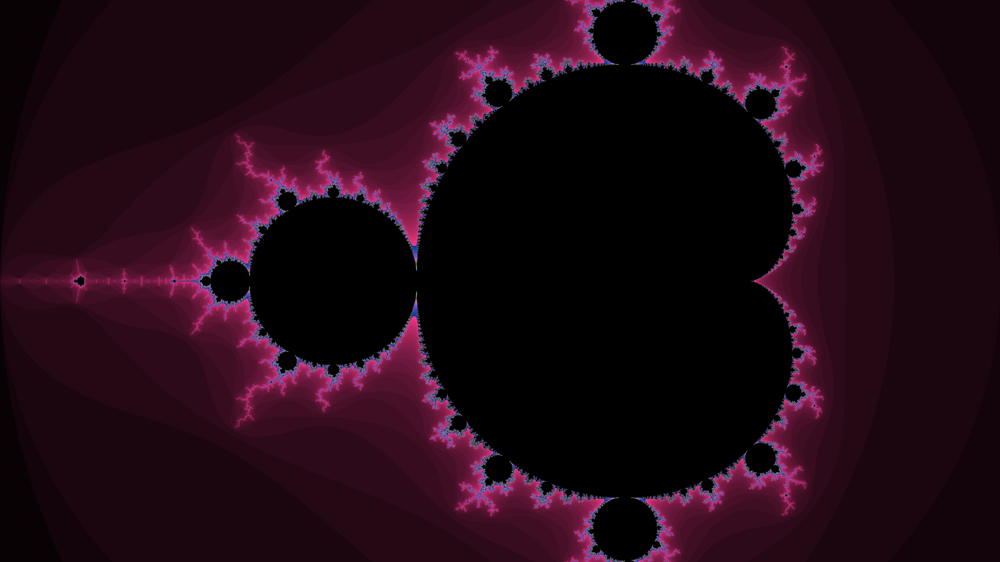
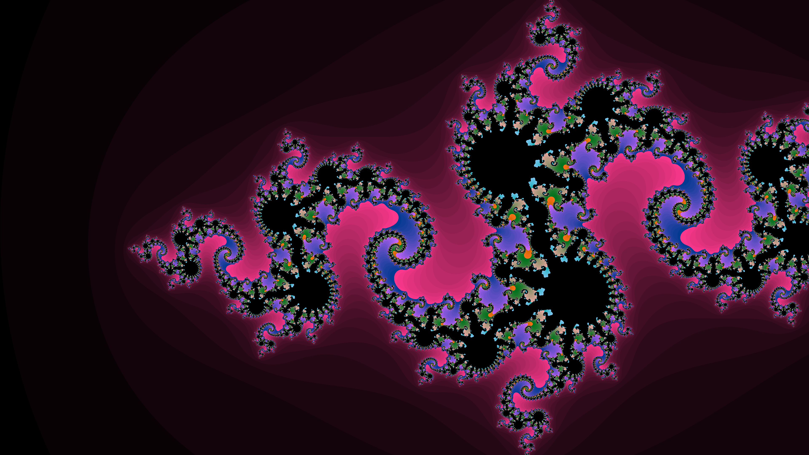

# FractalCPP - Parallel Fractal Generator

A high-performance C++ application that generates high-resolution fractals (Mandelbrot and Julia sets) using multi-threading. This project demonstrates custom thread pool implementation, complex number arithmetic, and PPM image rendering.

## Generated Examples

### Mandelbrot Set


### Julia Set


*Note: The raw output is in PPM format. The images above were converted to PNG for display.*

## Features
- **Multi-threaded Processing**: Uses a custom `ThreadPool` to parallelize rendering across rows.
- **Multiple Fractals**: Supports both **Mandelbrot** and **Julia** sets.
- **High Resolution**: Defaults to 4K (3840x2160) but supports custom resolutions.
- **Customizable**: Adjustable max iterations and thread count.
- **Portable**: No external dependencies (uses standard C++17 library).

## Project Structure
```
fractalcpp/
├── include/
│   ├── fractal.hpp      # Fractal math classes (Base, Mandelbrot, Julia)
│   ├── renderer.hpp     # Image buffer and PPM file writer
│   └── threadpool.hpp   # Custom thread pool implementation
├── src/
│   ├── main.cpp         # Entry point and argument parsing
│   ├── fractal.cpp      # Implementation of fractal algorithms
│   ├── renderer.cpp     # Implementation of image handling
│   └── threadpool.cpp   # Implementation of thread management
├── output/              # Directory for generated images
├── makefile             # Build configuration
└── README.md            # Project documentation
```

## Building

The project uses a standard `makefile`. To build:

```bash
make
```

This will compile the source files and create the `main` executable.

## Usage

```bash
./main <algorithm> <output_file> <num_threads> [width] [height]
```

### Arguments
- **algorithm**: `mandelbrot` or `julia` (case-insensitive).
- **output_file**: Path for the output image (e.g., `output.ppm`).
- **num_threads**: Number of worker threads to use.
- **[width]** (Optional): Image width (default: 3840).
- **[height]** (Optional): Image height (default: 2160).

### Examples

**Generate a standard 4K Mandelbrot set with 8 threads:**
```bash
./main mandelbrot output/mandelbrot.ppm 8
```

**Generate a customized 8K Julia set:**
```bash
./main julia output/julia_8k.ppm 16 7680 4320
```

## Viewing the Output
The program outputs **PPM (Portable Pixel Map)** files. 

- **Linux**: Open with `eog`, `feh`, or `display`.
- **Convert to PNG**: If you have ImageMagick installed:
  ```bash
  convert output.ppm output.png
  ```
